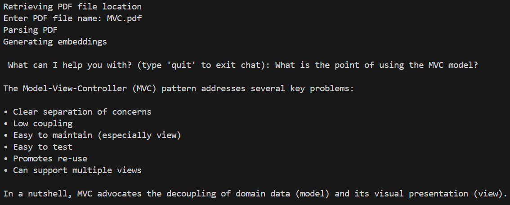
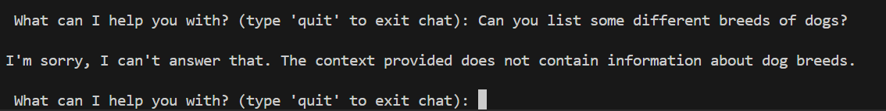

# Basic-LLM-Tutor

## A Python tool powered by Ollama which can read a PDF document and answer questions based on its content.

This tool uses a customised Llama 3 (8B parameters) model to answer questions solely on the content of any given PDF file. The custom model has adjusted parameters and a unique system prompt in order to make it adhere to the provided context, and avoid hallucinations.

## Screenshots

This screenshot shows an example of a prompt within the context provided by the PDF document. Here, the context is a PDF on the Model-View-Controller software design pattern.

This screenshot shows an example of a prompt outside of the context provided by the PDF document. This is using the same context as the screenshot above.